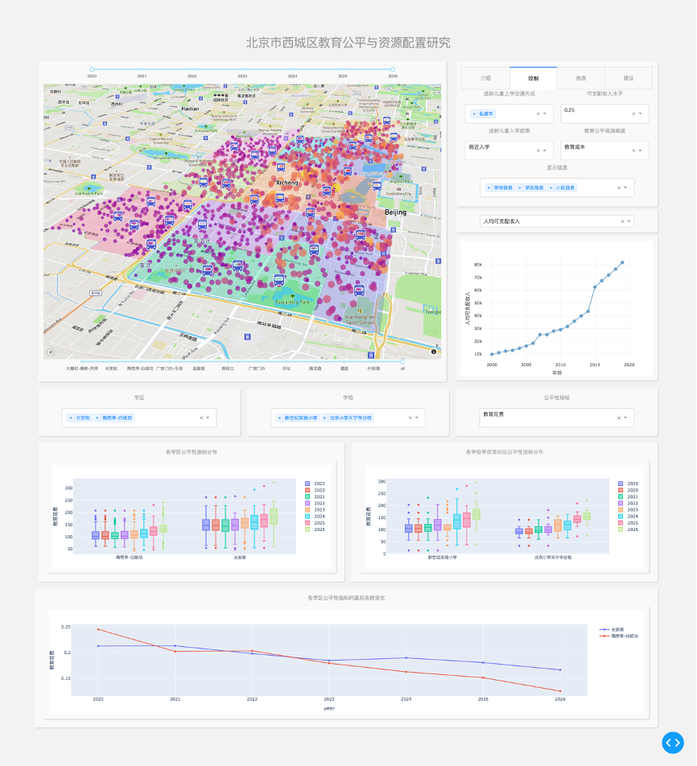

## Visual Map Analysis System for multi-school division and educational equity 
The Impact of "731" Multi-School Division Policy in Xicheng District on Educational Equity
Here, it is an Visual map system designed for analyzing the impact of multi-school division on Xicheng compulsory education, as mentioned in "Towards education equity, compulsory enrollment policy reform from nearby enrollment to multi-school division: a case study of Xicheng in China". it's user-friendly interface is as shown as follows:\n

## Prerequisities
* plotly
* plotly-dash

## Useage
* cd finnal_Xicheng_map_visual_system 
* python -u Mapapp2.py 
